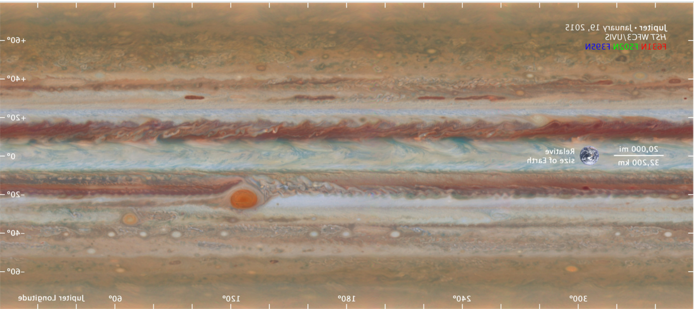
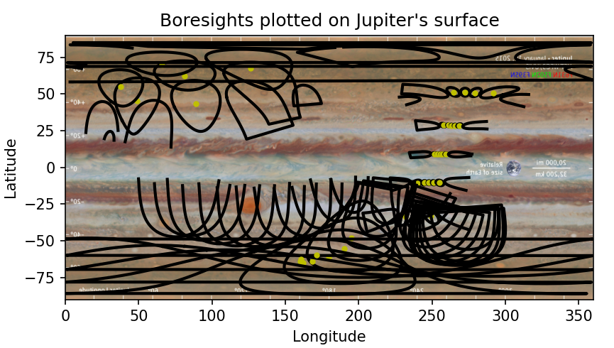
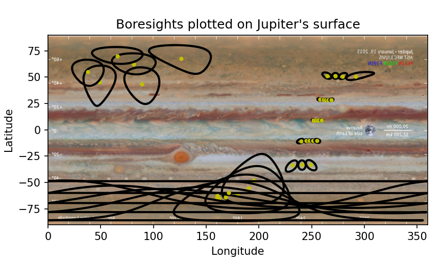

===================================
boresight_images code documentation
===================================

Authors: 
    Avi Skoczylas and Maddy Deming

This document will explain how the code works and what it is doing, step by step.

First, we must import the numpy, h5py, and matplotlib libraries in order to manipulate arrays, use h5 data, plot the data, and manipulate images, respectively. 

Next, we open the file for reading by specifying the filepath. 

Then, we convert the h5 file into numpy arrays (see juno_data_processing_documentation for details)
In this data file, list s1[0] is the latitude boundaries, list s1[1] is the longitude boundaries, and list s1[0] is the number of boundary points. 

However, there is a problem we have to deal with first: the file stores the value -999.9 when no actual data was measured, and this will mess up our plots unless we get rid
of these junk values. This is important only if we wish to plot incomplete ellipses (this will become clear later).

We work around this by using a data type called a mask, which tells functions to ignore certain parts of an array when operating on them. We will 
define our mask as all latitude and longitude points that are equal to -999.9 (the junk value, and not a valid latitude or longitude).

After we apply the mask, we can proceed with plotting the data. However, we want to see where these locations actually lie on jupiter's surface,
so we will add a cylindrical projection of jupiters surface to the plot, and stretch it to make sure it is scaled correctly.

We want to plot multiple footprints and boresights, but not all of them , so we will slice the array and only take the data from every nth row and column. You can decide
how much data you want to see by adjusting n, the sampling rate. 

Now, all you need to do is iterate through the arrays after slicing them, and plot all boundary points to see the ellipse footprints.
In order to plot the boresight, you simply take the average value of the latitude and longitude of each footprint point, and that is
the latitude and longitude of the boresight. However, this only works if the ellipse is complete, or has 360 boundary points, so you 
must add an if statement to only calculate boresights for complete ellipses. If you wish to only view complete ellipses, you may put the 
plot function for the ellipse in that same if statement. Both options are pictured below:

