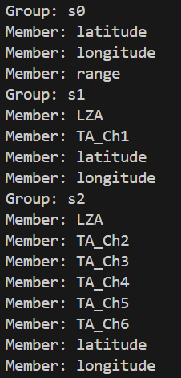
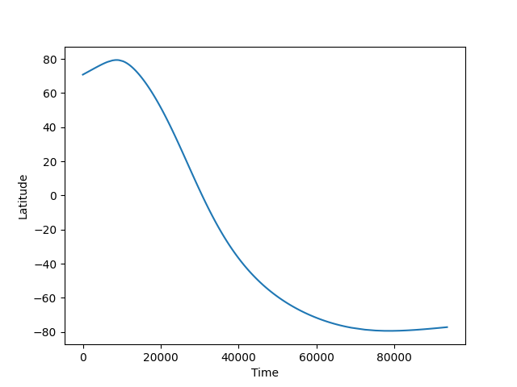
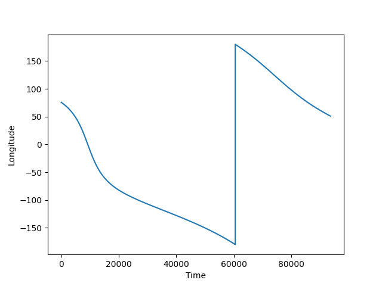
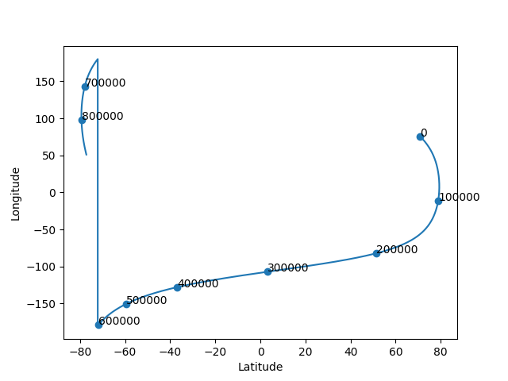

=====================================
juno_data_processing code explanation
=====================================

Authors: 
    Avi Skoczylas and Maddy Deming

This document will explain how the code works and what it is doing, step by step.

First, we must import the numpy, h5py, and matplotlib libraries in order to manipulate arrays, use h5 data, and plot the data respectively. 

Next, we open the file for reading by specifying the filepath. 

We then initialize 3 lists to group each of the 3 categories of juno data, and iterate through each group, appending the group 
members to the appropriate lists.

notes on details of manipulating this data: for a file f, f.keys() gets you all keys in the file.
f[x] gets you the group corresponding to the group's name (in this case, 'x').
for a group x, x[something] gets you the member corresponding to the member's name (in this case, 'something')

Now that we have all of our data in the form of lists, we can choose to print any of the lists, group names, members, etc.
if we want to see information about the datasets from the original file. 

    Description of Group and Member Data

We then convert all of the data sets into numpy arrays by simply telling numpy to turn each member of the group into an array.

Now that all of our datasets are in the form of numpy arrays, it will be easy to plot them!

For the 1D time dependent plots, we create a time axis manually based on the number of points in the dataset. 
We can then use matplot commands to generate, label, etc the plots of latitude and longitude vs time. 

    Plot of latitude vs. time

    Plot of longitude vs. time

We can also make a parametric plot which shows us the path the spacecraft took over the surface. 
If we want, we can use zip to make pairs of times and points to place timesteps on the plot as well.

    Plot of Juno's path over the surface with timesteps

2d plot explanations coming soon!
