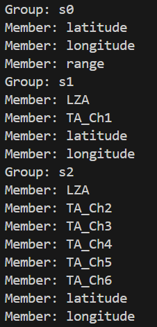
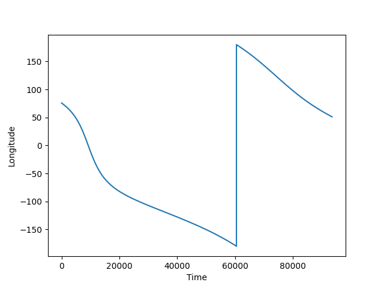
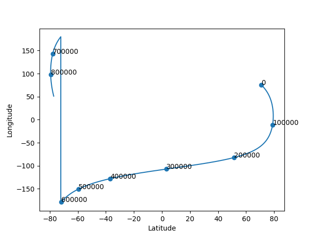
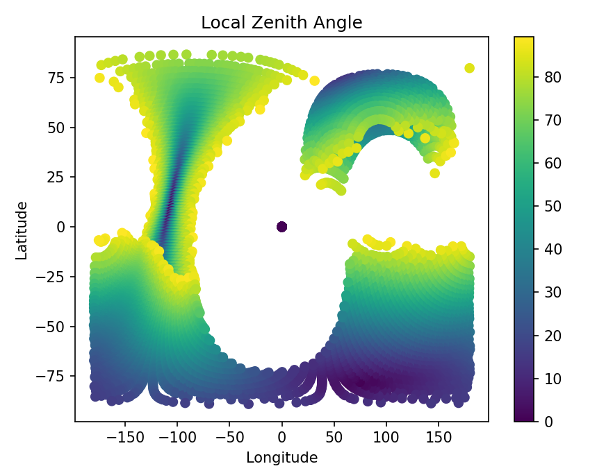

=======================================
juno_data_processing code documentation
=======================================

Authors: 
    Avi Skoczylas and Maddy Deming

This document will explain how the code works and what it is doing, step by step.

First, we must import the numpy, h5py, and matplotlib libraries in order to manipulate arrays, use h5 data, and plot the data respectively. 

Next, we open the file for reading by specifying the filepath. 

We then initialize 3 lists to group each of the 3 categories of juno data, and iterate through each group, appending the group 
members to the appropriate lists.

notes on details of manipulating this data: for a file f, f.keys() gets you all keys in the file.
f[x] gets you the group corresponding to the group's name (in this case, 'x').
for a group x, x[something] gets you the member corresponding to the member's name (in this case, 'something')

Now that we have all of our data in the form of lists, we can choose to print any of the lists, group names, members, etc.
if we want to see information about the datasets from the original file. 

We then convert all of the data sets into numpy arrays by simply telling numpy to turn each member of the group into an array.

Now that all of our datasets are in the form of numpy arrays, it will be easy to plot them!

Each individual plot is commented out in the code file, so uncomment any particular plot you wish to view.

For the 1D time dependent plots, we create a time axis manually based on the number of points in the dataset. 
We can then use matplot commands to generate, label, etc the plots of latitude and longitude vs time. 

.. figure:: latvtime.png
    :align: center

We can also make a parametric plot which shows us the path the spacecraft took over the surface. 
If we want, we can use zip to make pairs of times and points to place timesteps on the plot as well.

The 2d plots are a bit more complex. We want to plot temperature and local zenith angle as a function of longitude and latitude, but they are not given to us in that form. Rather, we are given the information in an arbitrary array, and we are given the longitudes and latitudes that correspond to each point on the array. 

We can "decode" this information by making 4 lists. one for angle, one for temperature, one for the corresponding latitude, one for the corresponding longitude. By iterating over the arbitrary arrays and assigning the corresponding data point in each to the end of the list, we can relate the data to each other without having to refer to the arbitrary array! 
Essentially, we have gone from 

Local Zenith Angle → Arbitrary Number, Arbitrary Number → Actual Location

to

Local Zenith Angle → Actual Location

Now, it is easy to make scatter plots that show the measured Local Zenith Angle at each location:

And the same goes for temperature plots:

.. figure:: tempch6.png
    :align: center

