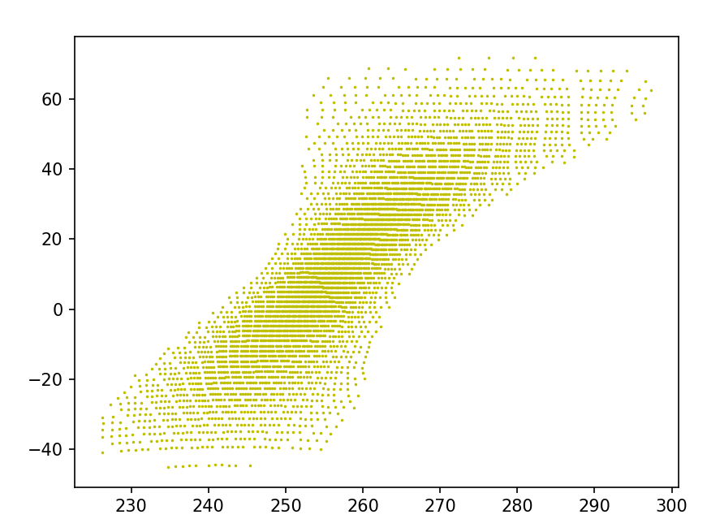
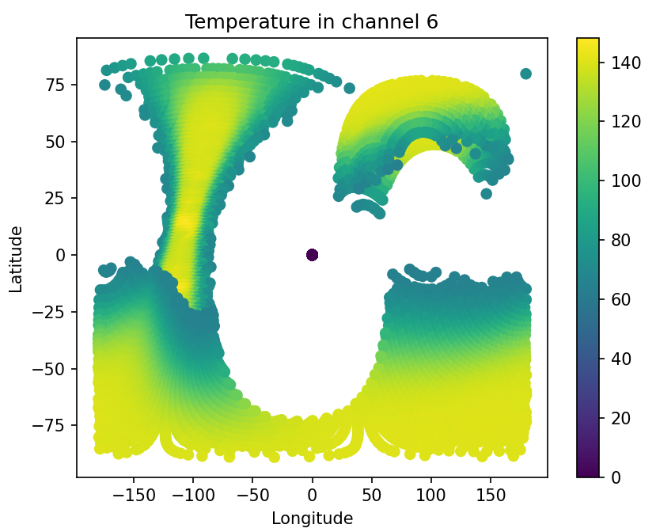
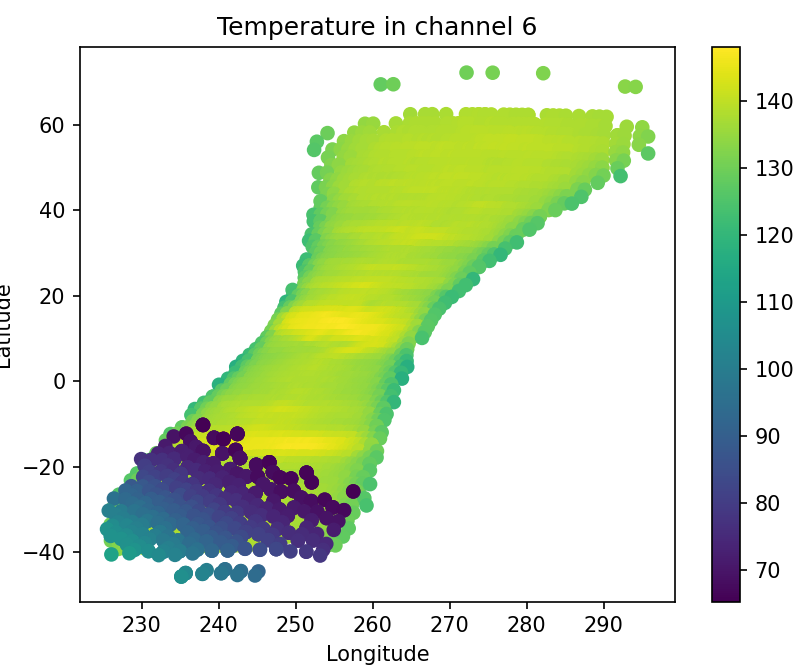
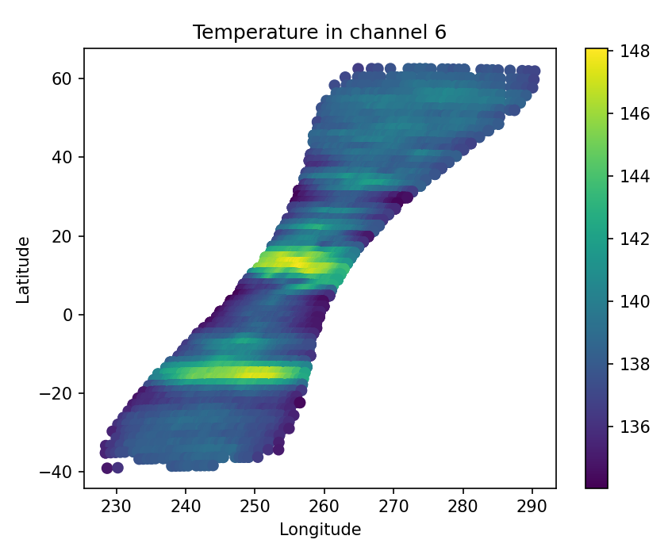

===================================
tchgraphs code documentation
===================================

Authors: 
    Avi Skoczylas and Maddy Deming

This document will explain how the code works and what it is doing, step by step.

Until line 44 we are simply converting h5 data to numpy arrays like in the other files. For details, see juno_data_processing code documentation.

We are only interested in datawithin certain longitudes, so next we define those longitudes. 

We then name and mask the boundary ellipse data as detailed in boresight_images code documentation. 

We calculate the boresight latitude and longitude by once again taking the average value of each ellipse boundary point's latitude and longitude. We store these in a list
for later use, but we convert to numpy so we are able to use numpy operations for distance calculation later. Optionally, we may plot the boresights here to better 
understand our data set. 

 We'll be using images from channel 6 to demonstrate.

Now that we have a list of boresight points, we want to generate a list of temperature points as well to see if they match with the boresights. We will also make a list
for local zenith angle, the purpose of which will be explained later. We simply iterate through the datasets and add any point that falls within our specified longitude range.

We initialize a shared indexes array to store the "matching points" between boresights and temperatures, and set a distance threshold that allows you to define how far away
a point can be for it to be considered "matching".

Next, we rearrange our latitude and longitude arrays into an array where each row is a point specified by a longitude and latitude, 
simply as a matter of convenience for the upcoming calculations. Once that's set up, we can simply calculate the distance between each temperature point and boresight.
if they are within the distance threshold (calculated using pythagorean theorem), we consider them the same point and add the index of the temperature point to our shared
indexes list so we know to plot it later. 

essentially, what we have done is laid the data below on top of the boresights and only kept the points that are directly on boresights! 

Next, we can easily isolate only the relevant parts of our other arrays by using syntax array=array[shared_indexes]. This will make a copy of the array that only includes
the data that existed at the shared indexes. 

Plotting this does show accurate data, but we can do better. For one, there is a lot of low temperature data near the bottom that isn't the focus of our study. Also, near the edges the temperature is read as lower than it actually is due to the high emmision angle.

We can get rid of this by filtering out temperatures below a certain threshold, and by filtering out angles above a certain threshold. This is where the angles list from earlier comes into play. Thanks to our foresight, we now have an emmision angle corresponding to each temperature point, so filtering to only include angles above 60 is as easy as saying angles<60.

for the sake of efficiency, we do the filtering by creating a truth array where points that obey the criteria are set to 1, and points that don't are set to 0. When you apply this to the original array, it efficiently gets rid of all points that don't comply.

Now, all that's left is to plot the data using matplotlib!

